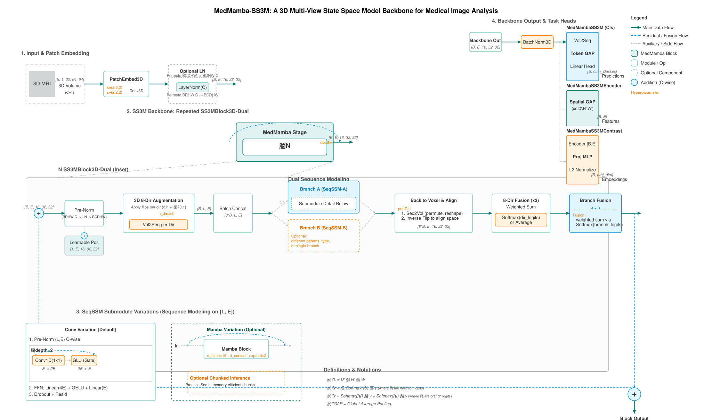

# MedMamba-SS3M · 面向路易体痴呆的 3D MRI 辅助诊断

> 基于 **Vision Mamba(SS3M 状态空间骨干)** 的 3D 脑磁体成像分类框架,核心聚焦
> **数据稀缺场景下的元学习小样本策略**:在 AD(阿尔茨海默病)vs LBD(路易体痴呆)
> 这一类别极度不平衡、单类样本极少的诊断任务上,系统对比并实现了多种 meta-learning
> 范式,并与 3D CNN / Swin / DenseNet 等主流骨干做统一基准评测。



---

## 一、为什么做这个项目

| 难点 | 说明 |
|------|------|
| **数据稀缺** | 3D 脑 MRI 标注成本高,LBD 这类疾病单类样本往往只有几十例(本数据集 AD 295 / LBD 38) |
| **类别不平衡** | AD 与 LBD 样本量相差约 8 倍,常规分类会严重偏向多数类 |
| **3D 建模开销大** | 体积输入序列极长,注意力类模型显存爆炸,需要线性复杂度的序列建模 |

这三点决定了:不能只堆大模型,而要在**骨干效率**(SS3M 线性复杂度)+ **小样本学习**(meta-learning)
两个方向同时发力。

## 二、核心方法

### 1. SS3M:8 向多视角状态空间骨干(算法骨干)
- 对 3D 体积做 **8 个方向(d/h/w 翻转组合)的扫描**,把每个方向的体素展开成序列,
  用 **Mamba(SSM)** 做线性复杂度序列建模,再按方向加权融合回体素空间。
- **双分支(Dual)结构**:主分支 + 可选辅助分支,融合权重由可学习 logits 经 softmax 得到,
  兼顾信息互补与训练稳定。
- 工程侧做了 **梯度检查点 + 序列分块(chunk_len)** 以压低 3D 长序列的显存峰值。

### 2. 自监督预训练(两阶段)
- **MAE(掩码自编码)**:无标签自监督,在四类(AD/LBD/MCI/NC)全部数据上预训练骨干。
- **对比学习(SupCon)**:以 MAE 权重初始化,进一步学习类别可分特征,为下游小样本微调打底。

### 3. 元学习小样本策略(★ 本项目重点)
在 `meta/strategies/` 下统一实现并对比多种 meta-learning 范式,适配 3D MRI + 类别不平衡:

| 策略 | 文件 | 思路 |
|------|------|------|
| **Vanilla** | `vanilla.py` | 普通微调基线 |
| **ANIL** | `anil.py` | 仅微调最后一层,一阶近似,小样本下最稳 |
| **MAML** | `maml.py` | 二阶快速适应,学习"易于适应"的初始化 |
| **ProtoNet** | `protonet.py` | 原型网络,嵌入空间度量学习 |
| **Hybrid** | `hybrid.py` | 组合上述策略的混合方案 |

配套 `run_experiments.py` / `run_auc90_matrix.py` 支持**矩阵化批量实验**:
按「骨干 × 策略 × 场强(3T/1.5T)× 折数」自动跑网格,统一输出指标与报告,
方便做消融与横向对比。

### 4. 统一基准评测(benchmark/)
`benchmark/` 是一套**方法无关**的实验框架,把不同骨干与元学习策略装进同一套
数据划分 / 训练 / 评测 / 报告流程,保证对比公平:

- **骨干**:`medmamba_ss3m`、`medmamba3d`、`cnn3d`、`resnet3d`、`densenet3d`、`convnext3d`、`swin3d`、`crossformer3d`
- **评测**:嵌套 5 折交叉验证 + 20% holdout 测试、ROC/AUC、平衡准确率(bal-acc)、混淆矩阵
- **复现**:`scripts/run_single.py`、`run_batch.py`、`generate_report.py` 一键跑通并出报告

## 三、仓库结构

```
code/
├── medmamba3d.py            # MedMamba3D 基础骨干 + MAE 解码器
├── medmamba_ss3m.py         # ★ SS3M 骨干(8 向扫描 + 双分支融合)
├── medmamba_ss3m_2dscan.py  # SS3M 2D 扫描变体
├── dataset_mri3d.py         # 3D MRI 数据加载 / 增强 / 采样
├── train_pretrain_mae.py    # 阶段1:MAE 自监督预训练
├── train_contrastive.py     # 阶段2:对比学习
├── train_classifier.py      # 阶段3:下游分类微调 + HPO
├── train_pipeline.py        # 端到端流水线入口
├── config.yaml              # 全局配置(数据/模型/三阶段/HPO)
│
├── meta/                    # ★ 元学习小样本(项目重点)
│   ├── strategies/          #   ANIL / MAML / ProtoNet / Hybrid / Vanilla
│   ├── train_classifier.py  #   元学习训练主程序
│   ├── run_experiments.py   #   批量实验调度
│   └── config*.yaml         #   代表性实验配置(3T/1.5T/消融)
│
├── benchmark/               # 统一基准评测框架
│   ├── core/                #   数据/训练/评测/指标/报告(方法无关)
│   ├── methods/
│   │   ├── backbones/       #   8 种骨干适配
│   │   └── meta_strategies/ #   元学习策略适配
│   ├── configs/methods/     #   各方法配置
│   └── scripts/             #   数据准备 / 单跑 / 批跑 / 报告
│
├── figure/pic.svg           # SS3M 骨干架构示意图
├── tests/                   # 训练/设备相关单测
└── requirements.txt
```

> 说明:`3DINO`(ViT 参考实现)为对比算法,非本项目代码,未包含在本仓库。
> 模型权重(`*.pth`)与原始数据(`*.nii`/`*.npy`)因体积与隐私不入库,见下文获取方式。

## 四、快速开始

### 环境
```bash
# Python 3.8+ / PyTorch + CUDA(Mamba 依赖 mamba_ssm,需匹配 CUDA 版本)
pip install -r requirements.txt
```

### 数据准备
数据为单通道 3D 体积,支持两种形式:
- `.nii` / `.nii.gz`:按类别分目录 `Dataset_112_npy/{AD,LBD,MCI,NC}/`
- `.npy`:已做脑区 Z-score(背景=0)的预卷数据,加载时跳过重复归一化

在 `config.yaml` 的 `paths.label_roots` 中指向各分类别目录即可
(仓库内已用相对占位路径,按本机实际位置修改)。

### 训练(三阶段)
```bash
# 1) MAE 自监督预训练
python train_pretrain_mae.py

# 2) 对比学习(以 MAE 权重初始化)
python train_contrastive.py

# 3) 下游分类微调
python train_classifier.py

# 或一键流水线
python train_pipeline.py
```

### 元学习实验(项目重点)
```bash
cd meta
python run_experiments.py            # 按矩阵跑「骨干 × 策略 × 场强 × 折」批量实验
python run_single.py --method anil --seed 42 --folds 5 --holdout-test 0.2   # 单方法验证
```

### 基准对比
```bash
cd benchmark
python scripts/run_single.py --method cnn3d_baseline --seed 42 --folds 2 --epochs 3
python scripts/run_batch.py            # 批量跑全部骨干/策略
python scripts/generate_report.py      # 汇总出报告
```

## 五、关键配置(`config.yaml`)

| 段 | 关键项 | 作用 |
|----|--------|------|
| `input` | `shape_dhw: [112,112,112]` | 统一输入尺寸 |
| `ss3m` | `n_dirs_train: 8`、`d_state`、`expand`、`chunk_len`、`use_checkpoint` | SS3M 骨干:方向数 / SSM 维 / 分块与检查点(显存关键) |
| `mae` | `mask_ratio_start/end`、`batch_size`、`grad_accum_steps` | MAE 预训练 |
| `contrast` | `loss_type: supcon`、`temperature`、`use_mae_init` | 对比学习 |
| `classifier` | `backbone: ss3m`、`loss: focal`、`use_class_weights` | 下游分类(类别不平衡用 focal + 类别权重) |
| `hpo` | `algorithm: three_stage`、`search_space` | 超参数搜索 |

## 六、结果

在 AD vs LBD 二分类(嵌套 5 折 + holdout 测试)上,SS3M 骨干结合元学习小样本策略,
在**类别不平衡、单类样本极少**的条件下,取得显著优于普通微调基线的区分能力;
其中 ANIL / ProtoNet 等一阶与度量式策略在小样本折上表现更稳。
具体数值随实验配置(场强 / 折数 / 策略)变化,见 `meta/out/` 与 `benchmark/` 的报告产物
(运行后生成,未随仓库发布)。

> 指标口径:`mean_bal_acc`(各类别召回均值,适配不平衡)、`mean_auc`(ROC 下面积)、`mean_acc`。

## 七、致谢与许可

- 骨干思想参考 **MedMamba**(Vision Mamba for Medical Image Classification)与 **SS3M**。
- 部分 3D 骨干(CNN/ResNet/CrossFormer)适配自公开开源实现,见各文件头部注释。
- 原始脑 MRI 数据为受保护医学数据,**未随仓库发布**;仅公开代码与实验框架。

```
MIT License(代码)。医学数据使用须遵守相应伦理与隐私规范。
```
